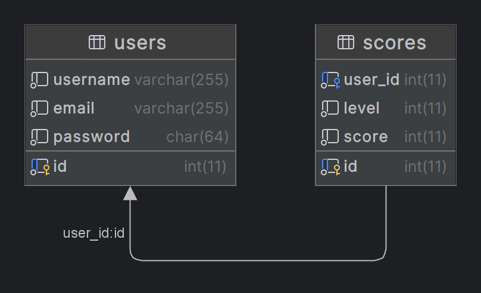

# BrickBreaker - Java Game

Joc de tip BrickBreaker dezvoltat în Java, care include salvarea utilizatorilor și a progresului fie într-o bază de date SQL, fie local în fișier, în funcție de setările alese de utilizator.

## Cuprins

- [Descriere](#descriere)
- [Funcționalități](#funcționalități)
- [Structura proiectului](#structura-proiectului)
- [Bază de date SQL](#bază-de-date-sql)
- [Cerințe](#cerințe)
- [Instalare și rulare](#instalare-și-rulare)


## Descriere

Acest joc BrickBreaker permite controlul unei platforme pentru a distruge cărămizi cu ajutorul unei bile. Utilizatorii se pot autentifica, iar progresul lor este salvat automat. La alegere, datele pot fi salvate fie într-o bază de date SQL, fie local în fișiere.

## Funcționalități

- Gameplay clasic BrickBreaker
- Autentificare utilizatori
- Salvare progres:
    - local (fișier)
    - în baza de date SQL, folosindu-se de driverul JDBC (`mysql-connector-j-9.3.0.jar`)
- Meniu principal și opțiuni
- Suport pentru gadgeturi temporare (power-ups)
- UI simplu, bazat pe Swing

## Structura proiectului

- `Main.java` – Punctul de intrare al aplicației
- `GameBoard.java` – Logica principală a jocului
- `GameMenu.java`, `Butoane.java` – Interfață grafică și meniuri
- `Ball.java`, `Brick.java`, `Platform.java` – Elemente de joc
- `Gadget.java`, `GadgetTime.java` – Power-ups
- `UserManager.java`, `Session.java` – Gestionare utilizatori și sesiuni
- `DBManager.java` – Salvare/încărcare din SQL

## Bază de date SQL
Baza de date are două tabele, în această formă:

- `users` – se stochează utilizatorii, iar parola este hash-uită în `SHA-256`
- `scores` – se stochează scorurile utilizatorilor pentru fiecare nivel finalizat

## Cerințe

- Java JDK 8+ (recomandat JDK 11)
- IDE: IntelliJ IDEA, Eclipse sau alt IDE compatibil
- Optional: un server SQL local (MySQL, SQLite, etc.)

## Instalare și rulare

- Clonează proiectul:
```bash
git clone https://github.com/razvanb113/brickbreaker.git
cd brickbreaker
```

- Rulează arhiva `BrickBreaker.jar`, disponibilă pe [GitHub](https://github.com/razvanb113/BrickBreaker/releases/tag/release)